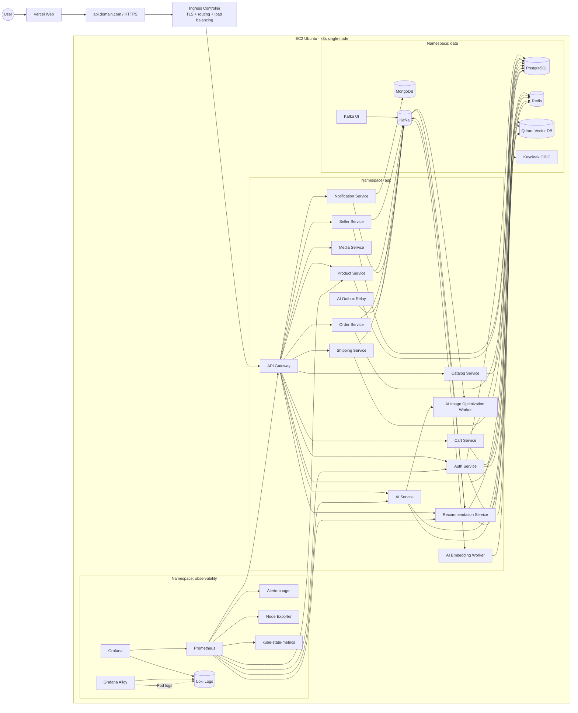

# Kiến trúc triển khai Bin E-Commerce

## Mục lục

- [Quyết định](#1-quyết-định)
- [Sơ đồ tổng quan](#2-sơ-đồ-tổng-quan)
- [K3s giải quyết những gì](#3-k3s-giải-quyết-những-gì)
- [Phân vùng Kubernetes](#4-phân-vùng-kubernetes)
- [Frontend và edge](#5-frontend-và-edge)
- [Application workloads](#6-application-workloads)
- [Infrastructure và data](#7-infrastructure-và-data)
- [Monitoring và metrics](#8-monitoring-và-metrics)
- [Logging tập trung](#9-logging-tập-trung)
- [CI/CD mục tiêu](#10-cicd-mục-tiêu)
- [Ngân sách và giới hạn](#11-ngân-sách-và-giới-hạn)
- [Các bước triển khai theo giai đoạn](#12-các-bước-triển-khai-theo-giai-đoạn)
- [Những điều không thuộc phạm vi triển khai hiện tại](#13-những-điều-không-thuộc-phạm-vi-triển-khai-hiện-tại)
- [Kết luận](#14-kết-luận)

## Tài liệu triển khai

- [Giai đoạn 1: Nền tảng triển khai](phase-1-foundation.md)

## 1. Quyết định

Chọn kiến trúc:

- Frontend deploy trên Vercel.
- Backend, infrastructure, AI workers, monitoring và logging thuộc cùng một kiến trúc EC2/k3s.
- Cài k3s trực tiếp trên EC2; k3s vừa làm Kubernetes control plane vừa làm worker.
- Dùng Ingress Controller bên trong k3s để terminate HTTPS, định tuyến request và load balance giữa các Pod.
- Không dùng Amazon EKS, AWS ALB, NAT Gateway, RDS, MSK hoặc ElastiCache trong phương án hiện tại.
- Khi đủ tài nguyên, các application service, AI service, AI workers, Prometheus, Grafana và logging stack chạy liên tục trên EC2.
- Chỉ các tác vụ nặng theo đợt như training, rebuild model hoặc backfill lớn mới chạy theo Job khi cần.

Đây là **single-node deployment**, không phải production HA. Mục tiêu là triển khai và vận hành được hệ thống, không tối ưu cho hàng triệu request hoặc khả năng chịu lỗi đa vùng.

## 2. Sơ đồ tổng quan



### Cách đọc sơ đồ

- Đường đi đồng bộ: `Vercel → Ingress → API Gateway → application service`.
- Đường đi bất đồng bộ: `application service → Kafka → worker/consumer`.
- PostgreSQL là database quan hệ chính; MongoDB phục vụ dữ liệu document của notification.
- Redis chỉ dùng cho cache, session, OTP, rate limit và trạng thái ngắn hạn.
- Qdrant lưu vector embedding cho semantic recommendation.
- Prometheus thu metrics; Grafana hiển thị metrics và logs; Loki lưu logs; Alloy thu logs từ Pod.
- Tất cả thành phần trong khung EC2 chạy trên cùng một k3s single-node.

### External providers

Một số luồng gọi ra ngoài cluster:

```text
AI Service ───────────────> AI provider / OpenAI
Shipping Service ─────────> GHN API
Media Service ────────────> Object storage / CDN nếu được cấu hình
```

Các provider bên ngoài không được coi là Kubernetes workload và phải được cấu hình bằng Secret.

## 3. K3s giải quyết những gì?

EC2 chỉ cung cấp máy chủ, CPU, RAM, disk và network. k3s là lớp điều phối chạy bên trong EC2, giúp mình quản lý toàn bộ container theo trạng thái mong muốn.

| Vấn đề khi chỉ chạy Docker thủ công | k3s giải quyết |
| --- | --- |
| Phải tự chạy từng container | Deployment/StatefulSet khai báo service cần chạy |
| Container chết thì phải khởi động lại bằng tay | Kubelet tự restart Pod theo health check |
| Service gọi nhau bằng IP khó quản lý | Kubernetes Service cung cấp DNS nội bộ ổn định |
| Không có cách scale rõ ràng | Tăng/giảm replica bằng Deployment |
| Public từng port service | Ingress gom public traffic vào một điểm vào |
| Request không được chia giữa nhiều instance | Service/Ingress load balance giữa các Pod |
| Cấu hình nằm rải rác trong image hoặc máy chủ | ConfigMap và Secret quản lý cấu hình tách khỏi image |
| Deploy phiên bản mới dễ làm gián đoạn | Rolling update, readiness probe và rollback |
| Không biết Pod nào đang lỗi | `kubectl`, Events, health checks và metrics |
| Worker và Job khó quản lý | Job/CronJob quản lý migration, backfill và training theo đợt |
| Không có chuẩn lưu trữ cho database | PVC gắn workload stateful với EBS |

k3s không tạo EC2, không thay thế database, không tự backup dữ liệu và không biến một EC2 thành hệ thống HA. Vì cluster này chỉ có một node, k3s giúp vận hành và quan sát workload tốt hơn nhưng không thể bảo vệ hệ thống khi EC2 bị hỏng.

## 4. Phân vùng Kubernetes

Các namespace mục tiêu:

| Namespace | Nội dung |
| --- | --- |
| `ingress` | Ingress Controller và TLS configuration |
| `app` | API Gateway, backend services, AI service và workers |
| `data` | PostgreSQL, MongoDB, Redis, Kafka, Qdrant, Keycloak |
| `observability` | Prometheus, Grafana, Alertmanager, Loki, Grafana Alloy |
| `jobs` | Migration, backfill, training hoặc rebuild model theo đợt |

`kube-system` dành cho các thành phần hệ thống của k3s và không chứa business workload.

## 5. Frontend và edge

### Vercel

Vercel phục vụ ứng dụng Next.js trong thư mục `web`.

- Build và deploy frontend.
- Cấu hình `NEXT_PUBLIC_API_URL=https://api.<domain>`.
- Không chạy database, worker hoặc business logic backend trên Vercel.
- Vercel gọi backend qua HTTPS public endpoint của Ingress.

### EC2 và Ingress

EC2 chỉ public các cổng cần thiết:

- `80`: redirect hoặc ACME challenge.
- `443`: HTTPS API và các dashboard đã bảo vệ.
- `22`: chỉ mở cho IP quản trị hoặc dùng SSM khi có thể.

Không public PostgreSQL, MongoDB, Redis, Kafka, Qdrant, Prometheus hoặc các port nội bộ của service.

Ingress chịu trách nhiệm:

- Route `api.<domain>` vào API Gateway.
- Route `grafana.<domain>` vào Grafana sau authentication.
- TLS certificate và redirect HTTP sang HTTPS.
- Load balance giữa các Pod cùng một Kubernetes Service.

Vì chỉ có một EC2, Ingress không cung cấp high availability cho toàn node. Nếu EC2 dừng, toàn bộ workload dừng.

## 6. Application workloads

### Cửa vào API

- `api-gateway`: public API duy nhất cho frontend và client.
- Gateway xác thực request, áp dụng policy cần thiết và proxy đến các service nội bộ.

### Identity và quyền truy cập

- `auth-service`: business logic liên quan đến tài khoản, session, user context và authorization.
- `keycloak`: OAuth2/OIDC identity provider, cấp token và quản lý realm/client.

### Commerce services

- `seller-service`: shop, seller onboarding, hồ sơ shop và vận hành seller.
- `product-service`: sản phẩm, biến thể, trạng thái và dữ liệu bán hàng.
- `catalog-service`: read model catalog cho truy vấn nhanh.
- `cart-service`: giỏ hàng.
- `order-service`: đơn hàng và trạng thái đơn.
- `shipping-service`: vận chuyển, địa chỉ và tích hợp GHN.
- `media-service`: upload và xử lý media.
- `notification-service`: thông báo và các luồng notification.

### Recommendation và AI

- `recommendation-service`: candidate generation, semantic retrieval, feature và ranking policy.
- `ai-service`: embedding, ML ranking và AI image optimization API.
- `ai-image-optimization-worker`: xử lý nền cho tối ưu ảnh.
- `ai-embedding-worker`: tạo embedding và publish event kết quả.
- `ai-outbox-relay`: đẩy outbox event sang Kafka.

Các service và worker trên chạy mặc định ít nhất một replica. Khi một Pod crash, k3s tự tạo lại Pod theo desired state.

## 7. Infrastructure và data

| Thành phần | Trách nhiệm | Cách lưu trữ |
| --- | --- | --- |
| PostgreSQL | Dữ liệu quan hệ cho các domain và Keycloak | Stateful workload + EBS PVC |
| MongoDB | Document data, hiện dùng cho notification | Stateful workload + EBS PVC |
| Redis | Cache, session, OTP, rate limit và realtime state | Stateful workload + EBS PVC |
| Kafka | Event bus và queue cho worker | Stateful workload + EBS PVC |
| Qdrant | Vector embedding và semantic retrieval | Stateful workload + EBS PVC |
| Keycloak | Identity provider OIDC/OAuth2 | PostgreSQL + PVC nếu cần |
| Kafka UI | Quan sát topic và consumer group | Internal hoặc protected Ingress |

Nguyên tắc dữ liệu:

- Mỗi service sở hữu database/schema của domain mình.
- Không dùng Redis làm source of truth cho job hoặc vector.
- Kafka xử lý event bất đồng bộ; consumer phải có retry và DLQ phù hợp.
- Qdrant là vector index; trạng thái tương thích của vector vẫn phải được kiểm soát từ dữ liệu domain.
- PVC không thay thế backup. PostgreSQL, MongoDB và Qdrant phải có backup định kỳ ra nơi lưu trữ ngoài node.

## 8. Monitoring và metrics

```text
EC2 / k3s / application
            |
            v
       Prometheus
            |
            v
        Grafana
            |
            +--> Dashboard
            +--> Alertmanager
```

### Thành phần

- `Prometheus`: scrape và lưu time-series metrics.
- `Grafana`: dashboard và truy vấn metrics.
- `Node Exporter`: CPU, RAM, disk và network của EC2.
- `kube-state-metrics`: trạng thái Deployment, Pod, Service và Replica.
- `Alertmanager`: cảnh báo khi có sự cố.

### Metrics cần theo dõi

- EC2 CPU, memory, disk và network.
- Pod restart, OOMKilled, readiness và liveness.
- HTTP request count, latency và tỷ lệ 4xx/5xx.
- Kafka consumer lag và số message retry.
- AI worker processing time, error rate và provider latency.
- Database connection, slow query và storage.
- Qdrant health và vector coverage.
- Recommendation fallback rate và model readiness.

Prometheus hiện đã có trong cấu hình local với retention 15 ngày. Khi chuyển sang k3s, cần chuyển phần này thành chart/manifests trong namespace `observability` và rà soát lại toàn bộ scrape target/port.

## 9. Logging tập trung

```text
Application stdout/stderr
            |
            v
   Kubernetes container logs
            |
            v
       Grafana Alloy
            |
            v
           Loki
            |
            v
   Grafana Explore / dashboard
```

### Thành phần

- `Grafana Alloy`: collector chạy dạng DaemonSet, đọc Pod logs và Kubernetes Events.
- `Loki`: lưu và tìm kiếm log tập trung.
- `Grafana`: dùng chung với Prometheus để xem metrics và logs trong một nơi.

Nên gắn các label có giới hạn cardinality:

- `namespace`
- `pod`
- `container`
- `app`
- `environment`
- `level`

Không dùng `userId`, `requestId` hoặc product ID làm label Loki nếu làm cardinality tăng quá lớn; các giá trị này nên nằm trong structured log fields.

Không ghi vào log:

- Password, access token, API key và secret.
- Raw image, raw prompt hoặc vector đầy đủ.
- Dữ liệu cá nhân không cần thiết.
- Toàn bộ payload nhạy cảm của event.

Retention log mục tiêu là 7–15 ngày để kiểm soát EBS. Log vẫn phải có rotation và giới hạn dung lượng để Loki không làm đầy disk của EC2.

## 10. CI/CD mục tiêu

```text
Git push
   |
   v
GitHub Actions
   |
   +--> lint / type-check / unit test
   +--> build Docker images
   +--> push image lên container registry
   +--> deploy Helm/manifests lên EC2 k3s
   +--> rollout status / health check
```

Thứ tự rollout:

1. Cập nhật namespace, Secret và ConfigMap.
2. Deploy storage và infrastructure dependencies.
3. Chạy database migration Job.
4. Deploy application services.
5. Deploy AI service và workers.
6. Deploy Prometheus, Grafana, Alertmanager, Loki và Alloy.
7. Kiểm tra readiness, health endpoint, Kafka consumer và dashboard.
8. Nếu rollout lỗi, rollback image/tag trước đó.

Image phải được tag bất biến theo commit SHA hoặc release version, không dùng `latest` trong môi trường deploy.

## 11. Ngân sách và giới hạn

Ngân sách mục tiêu là tối đa khoảng **200 USD trong 3 tháng**, chưa tính các khoản bất thường như data egress lớn, VAT hoặc dịch vụ phát sinh ngoài kế hoạch.

Biện pháp giữ ngân sách:

- Một EC2 chạy k3s single-node.
- Không dùng EKS managed.
- Không dùng AWS ALB/NLB; dùng Ingress trong k3s.
- Không dùng NAT Gateway.
- Không dùng RDS, MSK hoặc ElastiCache.
- Dùng EBS gp3 với dung lượng vừa đủ.
- Giới hạn retention Prometheus và Loki.
- Không expose database ra Internet.
- Theo dõi billing và đặt AWS Budget/alert.

`m7i-flex.large` với 2 vCPU và 8 GiB RAM là lựa chọn phù hợp hơn cho toàn bộ stack gồm database, Kafka, AI workers và observability trong phạm vi lưu lượng nhỏ. Cần đặt resource request/limit cho Pod và kiểm tra OOM trước khi rollout.

### Cấu hình Free Plan hiện tại

Tài khoản AWS hiện tại cho phép nhiều instance Free Tier. Cấu hình được chọn là `m7i-flex.large` với 2 vCPU và 8 GiB RAM. Với tối đa khoảng 5 người truy cập đồng thời, cấu hình này phù hợp hơn cho:

- Ubuntu, k3s và Traefik.
- API Gateway và các application service với một replica.
- Database, Kafka, AI workers và observability với resource limit chặt.

`m7i-flex.large` phù hợp cho lưu lượng nhỏ nhưng vẫn phải theo dõi RAM vì PostgreSQL, MongoDB, Kafka, Qdrant, Keycloak, AI workers, Prometheus, Grafana và Loki đều có chi phí RAM nền. Số người truy cập thấp không loại bỏ chi phí RAM nền của từng process.

Vì vậy có thể triển khai toàn bộ stack với một replica cho mỗi service, không training model nặng trên node và phải giới hạn resource. Nếu AWS Console hiển thị instance không còn Free tier eligible hoặc billing vượt hạn mức, cần dừng workload không cần thiết và kiểm tra AWS Budget.

## 12. Các bước triển khai theo giai đoạn

### Giai đoạn 1: Runtime cơ bản

- Tạo EC2 Ubuntu.
- Cài k3s, Helm và kubectl.
- Cấu hình Security Group, domain và HTTPS.
- Deploy Ingress và một service health check.

### Giai đoạn 2: Application

- Build/push image các service.
- Deploy API Gateway và commerce services.
- Kiểm tra authentication, public API và mutation flow.

### Giai đoạn 3: Infrastructure

- Deploy PostgreSQL, MongoDB, Redis, Kafka, Qdrant và Keycloak.
- Tạo PVC và backup.
- Chạy migration Job.

### Giai đoạn 4: AI và event pipeline

- Deploy `ai-service`.
- Deploy image, embedding và outbox workers.
- Kiểm tra Kafka topic, retry, DLQ và model fallback.

### Giai đoạn 5: Observability

- Deploy Prometheus và Grafana.
- Thêm Node Exporter, kube-state-metrics và Alertmanager.
- Deploy Loki và Alloy.
- Tạo dashboard metrics và log queries.

### Giai đoạn 6: CI/CD

- GitHub Actions chạy validation.
- Build image theo commit SHA.
- Push registry.
- Deploy và kiểm tra rollout tự động.

## 13. Những điều không thuộc phạm vi triển khai hiện tại

- Multi-node Kubernetes.
- HA control plane.
- Multi-AZ.
- Zero-downtime khi EC2 hỏng.
- Auto Scaling theo nhiều Availability Zone.
- Managed database production.
- Training model lớn trực tiếp trên EC2.
- Bảo đảm SLA production thương mại.

Khi dự án cần production thật, kiến trúc sẽ được tách lại: EKS hoặc cluster nhiều node, database managed, backup/restore chuyên dụng, load balancer managed, secret manager, tracing và disaster recovery.

## 14. Kết luận

Kiến trúc được chốt là:

```text
Vercel Web
    +
EC2 bật liên tục
    +
k3s single-node
    +
Ingress load balancing
    +
Toàn bộ backend và AI workers
    +
PostgreSQL / MongoDB / Redis / Kafka / Qdrant / Keycloak
    +
Prometheus / Grafana / Alertmanager
    +
Loki / Grafana Alloy
```

Đây là lựa chọn phù hợp cho dự án cá nhân vì đủ thực tế để học triển khai end-to-end, có monitoring và logging, nhưng vẫn giữ được chi phí và độ phức tạp trong phạm vi có thể tự vận hành.
